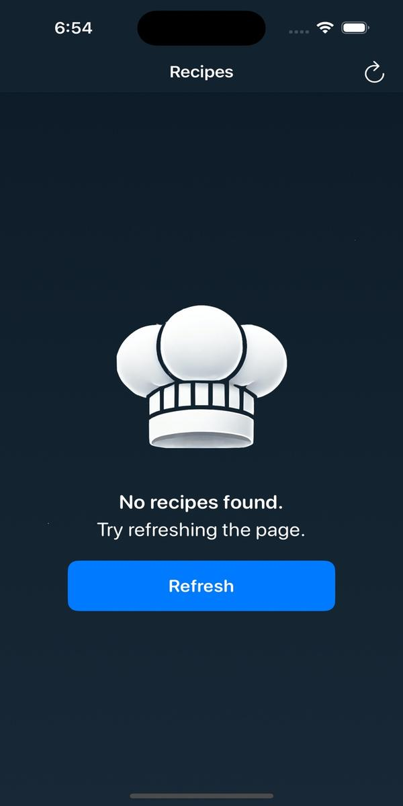

# FetchTakeHome

## Summary: 
This solution implements the MVVM (Model-View-ViewModel) architectural pattern with a structured, layered approach to ensure modularity, testability, and maintainability. The architecture follows a View → ViewModel → Service → Networking/Data Access flow, clearly separating concerns.

Architectural Overview:
- **View**: Displays UI components and observes ViewModel state.
- **ViewModel**: Contains presentation logic, interacts with the Service layer, and exposes data to the View.
- **Service Layer**: Acts as an intermediary between the ViewModel and underlying data sources (API & local storage).
- **Networking & Data Access Layer**: Handles API communication and Core Data persistence.

Key Features:
- **MVVM with a Clean Service Layer**: Ensures that ViewModels remain lightweight and only depend on abstracted services.
- **Networking Integration**: Fetches remote data from an API efficiently.
- **Core Data Storage**: Caches relevant data for offline access.
- **Separation of Concerns**: Each layer is responsible for a distinct function, making the codebase scalable and maintainable.

Screenshots & Demo:

  
  
  
  
  

## Focus Areas: 
For this project, I prioritized a bottom-up approach, beginning with the Networking and Storage layer, followed by the Service layer, and finally implementing the ViewModel and View layers.

This approach allowed me to define and solidify the interfaces and contracts at each layer early in the process, ensuring clear separation of concerns and consistent data flow throughout the architecture. By establishing a strong foundation with the lower layers, I was able to build the upper layers with confidence, knowing that they would rely on well-defined and robust abstractions.
 
This method aligns with my preferred design philosophy and has consistently proven effective in delivering scalable, maintainable, and testable software solutions.

## Time Spent: 
I spent approximately 12–16 hours working on this project. The majority of my time was focused on the Networking and Storage layer and the UI implementation.
- **Networking and Storage Layer**: I spent the most time here because this layer serves as the foundation for the entire application. Ensuring it was solid and reliable was crucial before building the rest of the app.
- **UI Implementation**: Implementing the UI took considerable time to ensure it functioned correctly and met the project’s requirements.

Other areas, such as the Service Layer and ViewModel, required less time but were still essential to integrating the app’s functionality effectively.

## Trade-offs and Decisions:

Throughout the development process, I made trade-offs to balance implementation time and functionality:

- **No Retry Logic for API Calls**: The application does not implement retry logic for failed API requests. This could improve reliability in cases of temporary network issues.
- **Limited Caching**: Only images are cached, while the list of recipes is not. Caching the recipe list would allow offline access, but I opted to keep the implementation simple for this version.
- **Error Handling**: While errors are handled, the current approach does not provide the user with clear recovery options or next steps. Improving this would enhance the user experience.

These decisions were made to keep the scope manageable within the available time while focusing on core functionality. Future iterations could address these trade-offs based on user needs and project requirements.

## Weakest Part of the Project:

While the core functionality is implemented, there are several areas that could be improved:  

- **No Telemetry or Logging**: Errors and logs are not captured, making it difficult to diagnose issues. If the app crashes, crash logs are not persisted, limiting the ability to analyze failures.  
- **No Configuration Management**: While not needed for this app, a production-ready application should have a way to determine the environment it is running in (e.g., development, staging, production) and manage environment-specific settings dynamically.  
- **Missing Features**: The application could be enhanced by utilizing the YouTube URL associated with each recipe, providing users with additional content and an improved experience.  

These areas could be addressed in future iterations to make the application more production-ready.

## Additional Information  

While working on the image downloading functionality, I noticed that memory usage was increasing significantly. After investigating, I found an inefficiency in the way images were being loaded and stored. I refactored the image handling logic, resulting in a **22% reduction in memory footprint**.  

This optimization improved the app’s overall efficiency and performance. In a larger-scale application, similar optimizations would be essential for maintaining smooth performance and minimizing resource usage.
